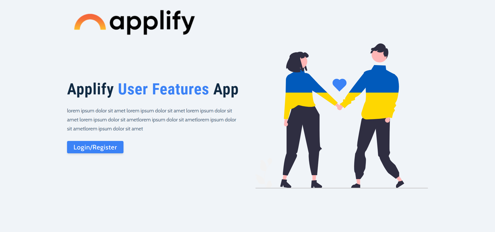
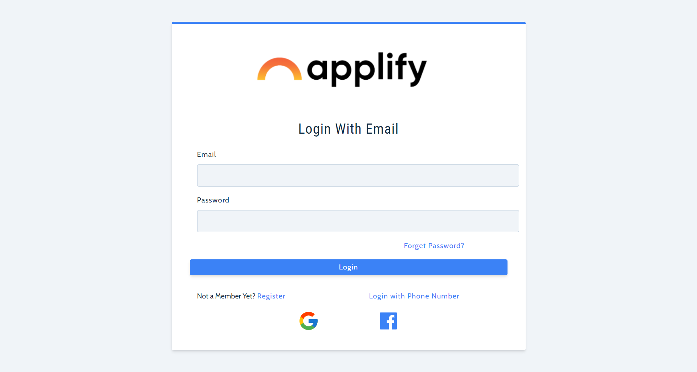
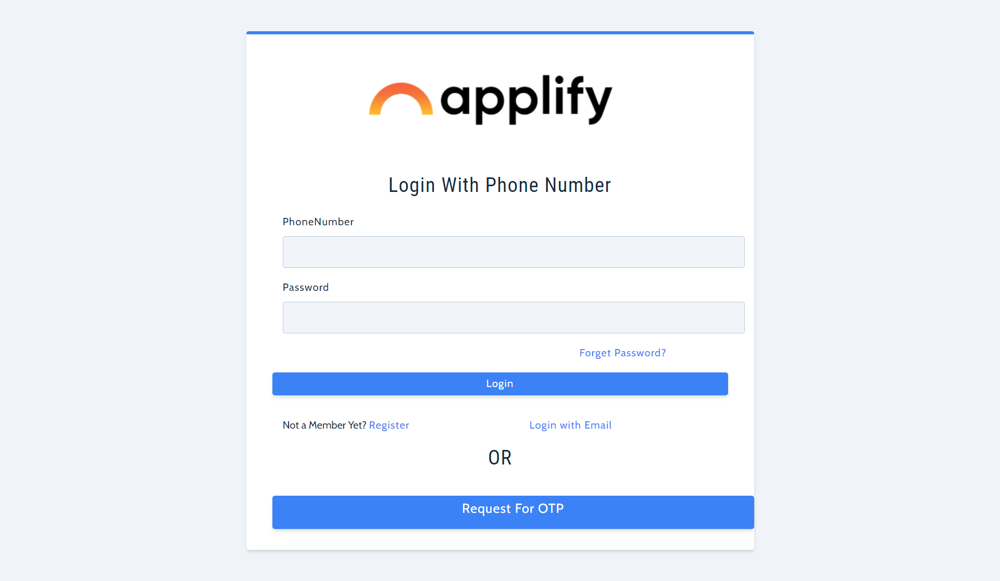
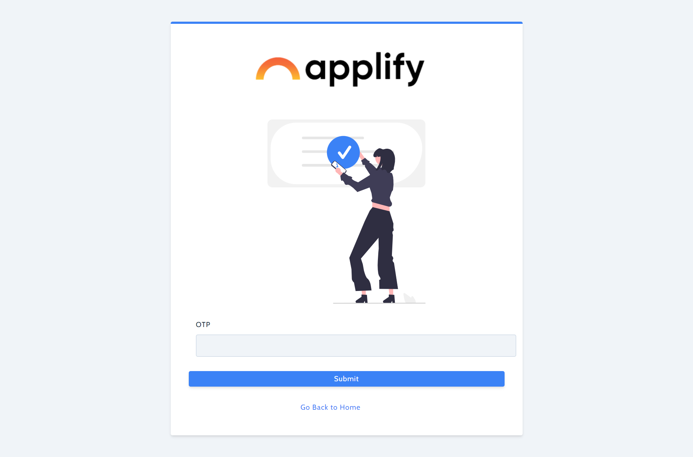
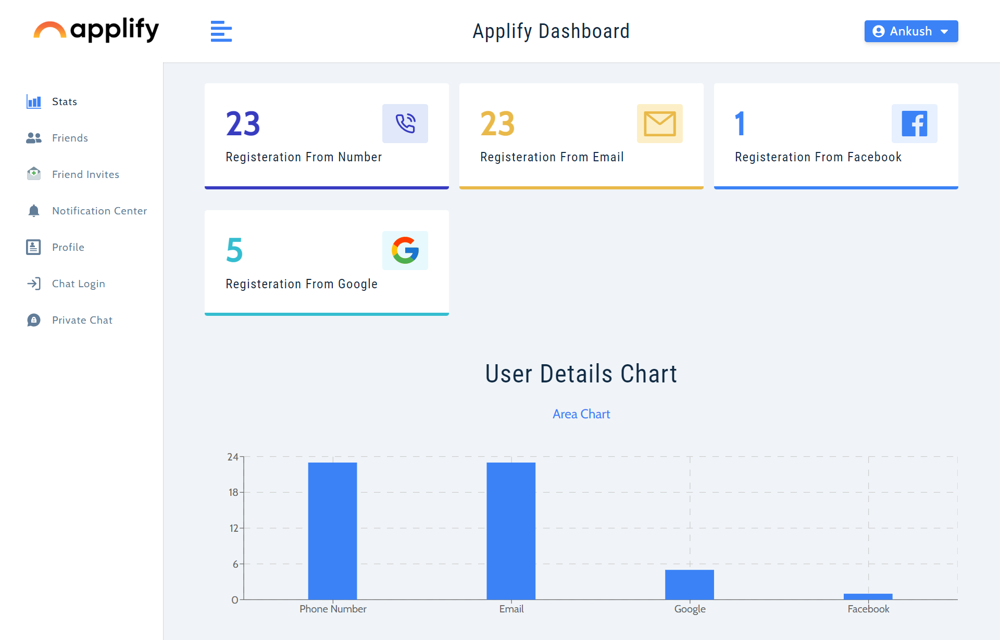
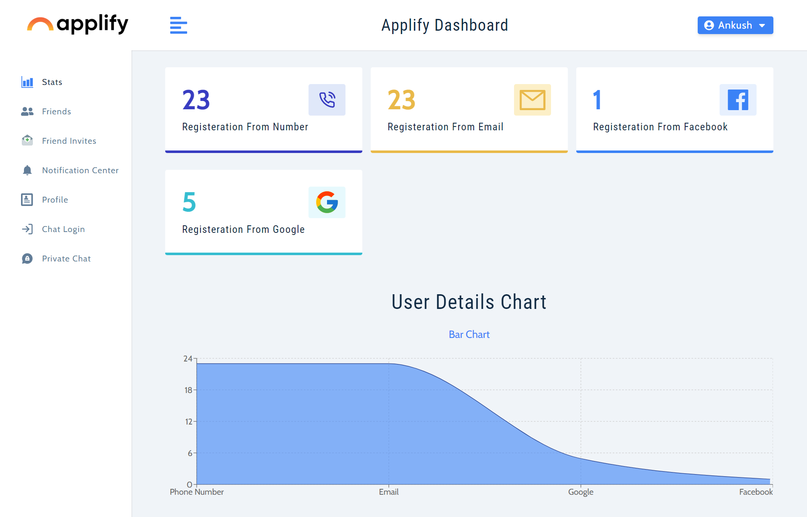
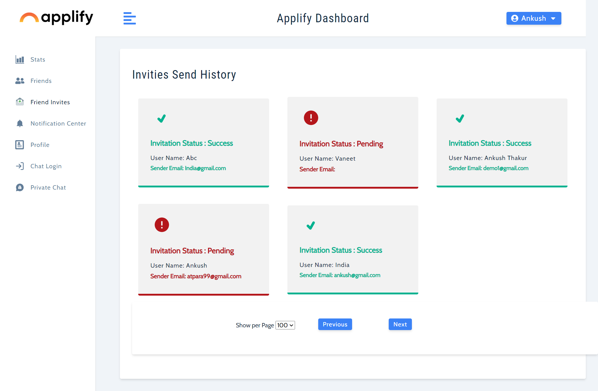

# Admin Panel Dashboard

# Developed by : `Ankush Thakur and Tanvi Negi`

# Technology Used

- HTML
- CSS
- Styled UI
- React
- Firebase
- One Signal
- React Charts
- ExpressJS
- NodeJS
- Swagger
- Mysql

---

## Description

- Full Fledged Multiple Login System with:
  - Email & Password
  - Phone Number & Password
  - Phone Number & OTP
  - Social Media Login (Google, Facebook)
- One to One real-time chat with Firebase
- Real-Time Push Notification through OneSignal
- Graphical representation of Charts, barsin the Dashboard
  GitHub Repo

# Images

### Home Page

### Login (Email)

### Login (OTP)

### Dashboard

### Charts

### Invities List

